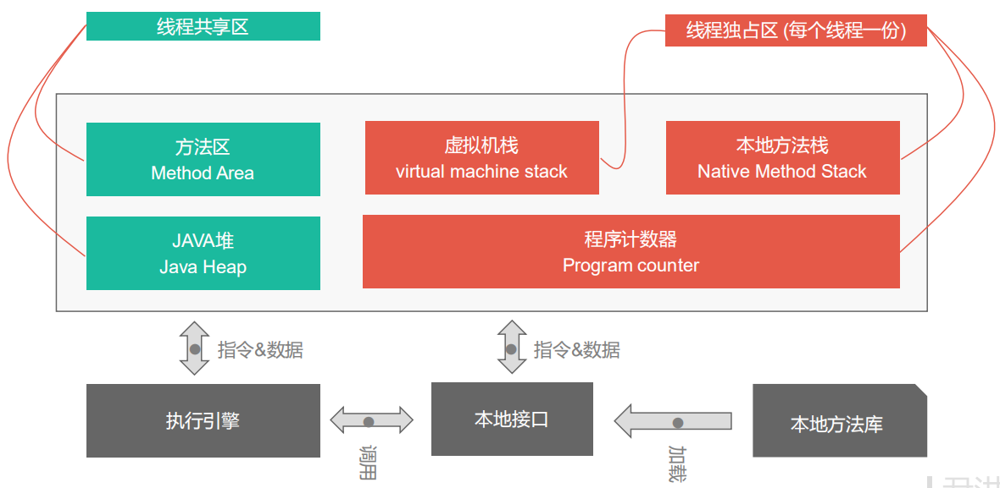

# 第二章 Java内存区域与内存溢出异常

## 2.2 运行时数据区

### 2.2.1 程序计数器

- 程序计数器是一块较小的内存空间；
- 程序计数器是线程私有的，每个线程中有一个程序计数器；
- 字节码指示器工作时就是通过改变这个计数器的值来选取下一条需要执行的字节码指令；
- 分支、循环、跳转、异常处理、线程恢复等基础功能都需要依赖这个计数器来完成；
- 如果线程正在执行的是一个Java方法，这个计数器记录的是正在执行的虚拟机字节码指令的地址；
- 如果正在执行的是一个Native 方法，这个计数器则为空。
- 此内存区域是唯一一个没有规定任何OutOfMemoryError 的区域。

### 2.2.2 Java虚拟机栈

- Java虚拟机栈也是线程私有的；
- 它的生命周期与线程相同；
- 虚拟机栈描述的是Java方法执行的内存模型，每个方法在执行时，都会创建一个栈帧；
- 每个方法从调用直至执行完成的过程，就对应着一个栈帧在虚拟机栈中入栈到出栈的过程；
- 如果线程请求的栈深度大于虚拟机所允许的深度，则抛出StackOverflowError 异常；
- 如果虚拟机栈可以动态扩展，当扩展时无法申请到足够的内存时，会抛出OutOfMemoryError 异常；

#### 2.2.2.1 栈帧

- 栈帧用于存储局部变量表、操作数栈、动态链接、方法出口等信息；
- 局部变量表存放了编译期可知的各种基本数据类型、对象引用和returnAddress 类型；
- 其中64位长度的long 和 double 类型数据会占用2个局部变量空间(Slot)，其余的数据类型只占用一个；
- 局部变量表所需的内存空间在编译期间完成分配，在方法运行期间不会改变局部变量表的大小。

### 2.2.3  本地方法栈

- 本地方法栈与虚拟机栈所发挥的作用是非常相似的；
- 它们之间的区别是虚拟机栈为虚拟机执行Java方法(也就是字节码)服务；
- 而本地方法栈则为虚拟机使用到的Native 方法服务；
- 本地方法栈区域也会抛出StackOverflowError 和OutOfMemoryError 异常。

### 2.2.4 Java堆

- 对于大多数应用来说，Java堆区是虚拟机所管理的内存中最大的一块；
- Java 堆是被所有线程共享的一块内存区域，在虚拟机启动时创建；
- 此内存区域的唯一目的是存放对象实例，几乎所有的对象实例都在这里分配内存；
- Java 堆是垃圾回收器管理的主要区域；
- 如果堆中没有内存完成实例分配，并且堆也无法在再扩展时，将会抛出OutOfMemoryError 异常。

### 2.2.5 方法区

- 方法区也是被各个线程共享的一块内存区域；
- 它用于存储已被虚拟机加载的类信息、常量、静态变量、即时编译器编译后的代码等数据；
- 当方法区无法满足内存分配需求时，将抛出OutOfMemorryError 异常.

#### 2.2.5.1  运行时常量池

- 运行时常量池是方法区的一部分;
- 常量池用于存放编译期生成的各种字面量和符号引用将在类加载后进入方法区的运行时常量池中存放;
- 当运行时常量池无法再申请到内存时,会抛出OutOfMemoryError 异常.

### 2.2.6 直接内存

- 直接内存并不是虚拟机运行时数据区的一部分,也不是Java虚拟机规范中定义的内存区域;
- 当大于内存限制时,依旧会抛出OutOfMemoryError 异常.

## 2.3 HotSpot 虚拟机对象探秘

### 2.3.1 对象的创建流程：

1. 虚拟机遇到一条new 指令；
2. 检查这个指令的参数是否能在常量池中定位到这个类的符号引用；
3. 检查这个符号引用代表的类是否已被加载、解析和初始化过；
4. 如果没有被加载，则必须先执行相应的类加载工作；
5. 类加载检查通过后，虚拟机将为新手对象分配内存；
6. 对象所需的内存大小在类加载完成后便可完全确定；
7. 内存划分的方法有：“指针碰撞”和“空闲列表”两种方式，详情见后；
8. 内存划分期间的并发问题解决方案有：同步处理方式和TLAB方式，详情见后；
9. 内存分配完成后，虚拟机需要将分配到的内存空间全部初始为0(对象头除外)；
10. 然后设置必要信息，例如对象是哪个类的实例，如何才能找到类的元数据信息、对象的哈希码、对象的GC分代年龄等信息。
11. 执行<init>方法，初始化对象数据；

#### 2.3.1.1 指针碰撞法

- 在假设Java堆中内存是绝对规整的，
- 所有用过的内存都放在一边，空闲的内存放在另一边，
- 中间放着一个指针，作为分界点的指示器，
- 分配内存就仅仅把那个指针往空闲空间那面移一段与对象大小相等的距离就行。

#### 2.3.1.2 空闲列表法

- 如果Java堆中的内存并不是规整的，已使用的内存和空闲内存相互交错，
- 虚拟机就必须维护一个列表，
- 记录哪些内存块是可用的，
- 在分配的时候从列表中找到一块足够大的空间划分给对象实例，并更新列表上的记录。

#### 2.3.1.3  同步处理方式

对分配内存空间的动作进行同步处理，实际上虚拟机采用CAS配上失败重试的方式保证更新操作的原子性。

#### 2.3.1.4 TLAB

- 把内存分配的动作按照线程划分在不同的空间中进行，
- 即每个线程在Java堆中预先分配一小块内存，
- 称为本地线程分配缓存(Thread Local Allocation Buffer，TLAB)，
- 只有TLAB 用完并分配新的TLAB时，才需要同步锁定。

### 2.3.2 对象的内存布局

对象在存储中的布局可分为三块区域：对象头(Header)、实例数据(Instance Data)和对齐填充(Padding)。

#### 2.3.2.1 对象头

HotSpot 虚拟机的对象头包括两部分的信息：Mark Word 和 类型指针。

Mark Word ：用于存储对象自身的运行时数据，如哈希码(HashCode)、GC分代年龄、锁状态标志、线程持有的锁、偏向线程ID、偏向时间戳等。

类型指针：

- 即对象指向它的类元数据的指针，虚拟机通过这个指针来确定这个对象是哪个类的实例。
- 并不是所有的虚拟机实现都必须在对象数据上保留类型指针。
- 如果对象是一个Java数组，那在对象头中还必须有一块用于记录数组长度的数据，用以确定数组的大小。

#### 2.3.2.2 实例数据

- 实例数据部分是对象真正存储的有效信息，也是在程序代码中所定义的各种类型的字段内容；
- 无论是从父类继承下来的，还是在子类中定义的，都需要记录起来；
- HotSpot 默认的分配策略为：相同宽度的字段分配到一起；
- 在满足上面一个条件的情况下，在父类中定义的变量会出现在子类之前。

#### 2.3.2.3 对齐填充

- 对齐填充并不是必然存在的，也没有特别的意义，它仅仅起着占位符的作用。

### 2.3.3 对象的访问定位

对对象的访问方式目前主流的有两种：使用句柄和直接指针。

#### 2.3.3.1 使用句柄访问

- 使用句柄访问，会在Java堆中划分出一块内存来作为句柄池；
- reference 中存储的就是对象的句柄地址；
- 句柄中包含了对象的实例数据与类型数据各自的具体地址信息。

#### 2.3.3.2 使用直接指针访问

- 如果使用直接指针访问，那么Java堆对象的布局中必须考虑如何放置访问类型数据的相关信息；
- 而reference 中存储的直接就是对象地址。

#### 2.3.3.3 两种方式的比较

- 使用句柄访问的优势：reference中存储的是稳定的句柄地址，在对象被移动(垃圾回收时移动对象是很普遍的行为)时只会改变句柄中实例数据的指针，而reference本身不需要修改。

- 使用直接指针访问的优点是：访问速度快，它节约了的一次指针定位的时间开销，由于对象的访问在Java中是非常频繁的，因此这类开销积少成多，也是一项非常可观的执行成本。

  

