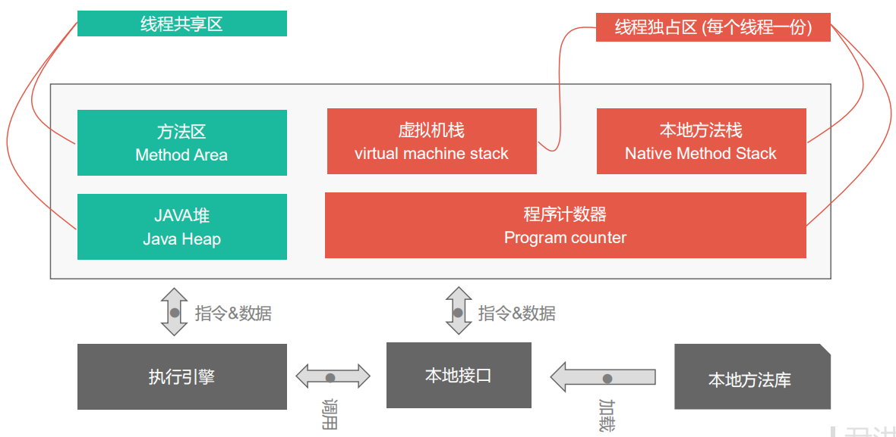
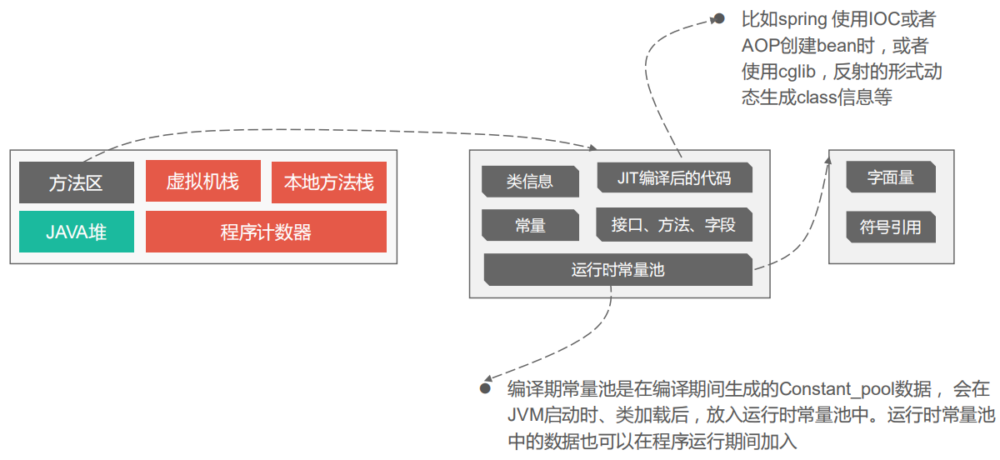
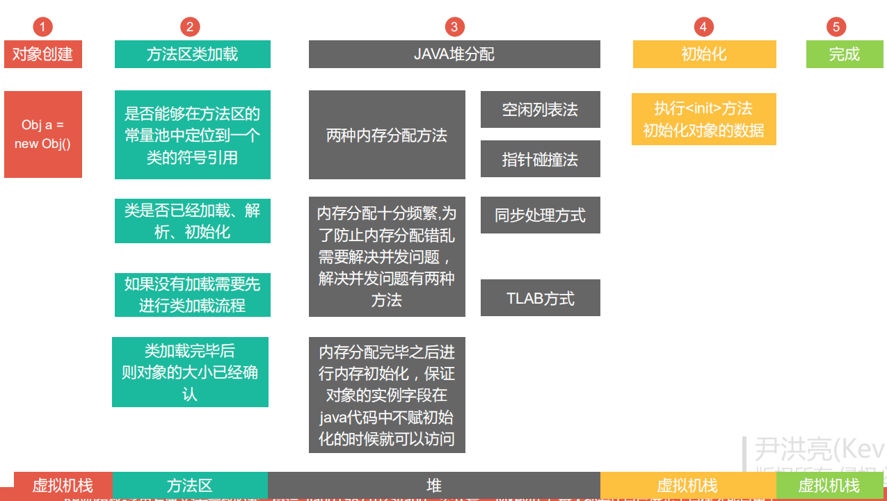
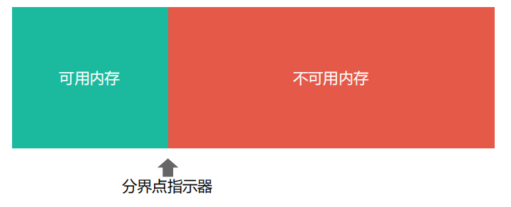
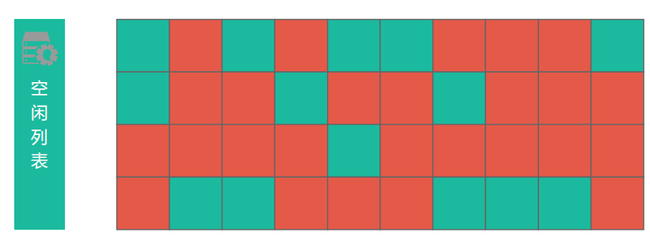
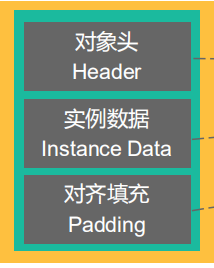
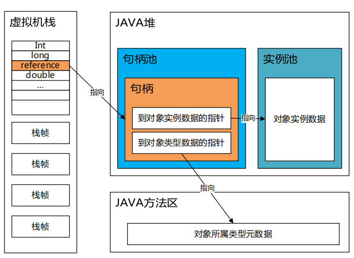
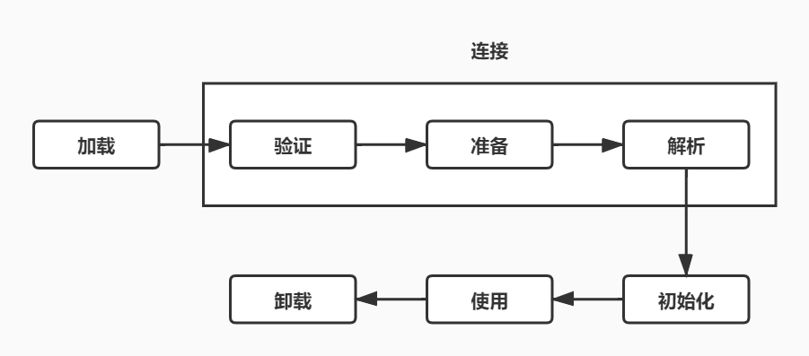
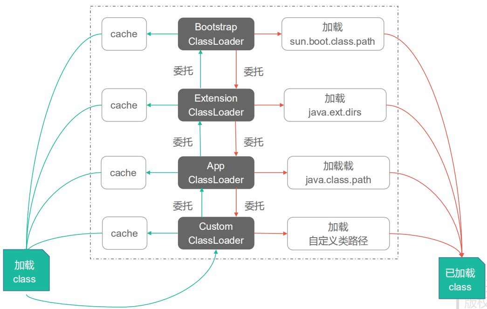

# 第二章 Java内存区域与内存溢出异常

## 2.2 运行时数据区

### 2.2.1 程序计数器

- 程序计数器是一块较小的内存空间；
- 程序计数器是线程私有的，每个线程中有一个程序计数器；
- 字节码指示器工作时就是通过改变这个计数器的值来选取下一条需要执行的字节码指令；
- 分支、循环、跳转、异常处理、线程恢复等基础功能都需要依赖这个计数器来完成；
- 如果线程正在执行的是一个Java方法，这个计数器记录的是正在执行的虚拟机字节码指令的地址；
- 如果正在执行的是一个Native 方法，这个计数器则为空。
- 此内存区域是唯一一个没有规定任何OutOfMemoryError 的区域。

### 2.2.2 Java虚拟机栈

- Java虚拟机栈也是线程私有的；
- 它的生命周期与线程相同；
- 虚拟机栈描述的是Java方法执行的内存模型，每个方法在执行时，都会创建一个栈帧；
- 每个方法从调用直至执行完成的过程，就对应着一个栈帧在虚拟机栈中入栈到出栈的过程；
- 如果线程请求的栈深度大于虚拟机所允许的深度，则抛出StackOverflowError 异常；
- 如果虚拟机栈可以动态扩展，当扩展时无法申请到足够的内存时，会抛出OutOfMemoryError 异常；

#### 2.2.2.1 栈帧

- 栈帧用于存储局部变量表、操作数栈、动态链接、方法出口等信息；
- 局部变量表存放了编译期可知的各种基本数据类型、对象引用和returnAddress 类型；
- 其中64位长度的long 和 double 类型数据会占用2个局部变量空间(Slot)，其余的数据类型只占用一个；
- 局部变量表所需的内存空间在编译期间完成分配，在方法运行期间不会改变局部变量表的大小。

### 2.2.3  本地方法栈

- 本地方法栈与虚拟机栈所发挥的作用是非常相似的；
- 它们之间的区别是虚拟机栈为虚拟机执行Java方法(也就是字节码)服务；
- 而本地方法栈则为虚拟机使用到的Native 方法服务；
- 本地方法栈区域也会抛出StackOverflowError 和OutOfMemoryError 异常。

### 2.2.4 Java堆

- 对于大多数应用来说，Java堆区是虚拟机所管理的内存中最大的一块；
- Java 堆是被所有线程共享的一块内存区域，在虚拟机启动时创建；
- 此内存区域的唯一目的是存放对象实例，几乎所有的对象实例都在这里分配内存；
- Java 堆是垃圾回收器管理的主要区域；
- 如果堆中没有内存完成实例分配，并且堆也无法在再扩展时，将会抛出OutOfMemoryError 异常。

### 2.2.5 方法区

- 方法区也是被各个线程共享的一块内存区域；
- 它用于存储已被虚拟机加载的类信息、常量、静态变量、即时编译器编译后的代码等数据；
- 当方法区无法满足内存分配需求时，将抛出OutOfMemorryError 异常.

#### 2.2.5.1  运行时常量池

- 运行时常量池是方法区的一部分;
- 常量池用于存放编译期生成的各种字面量和符号引用将在类加载后进入方法区的运行时常量池中存放;
- 当运行时常量池无法再申请到内存时,会抛出OutOfMemoryError 异常.

### 2.2.6 直接内存

- 直接内存并不是虚拟机运行时数据区的一部分,也不是Java虚拟机规范中定义的内存区域;
- 当大于内存限制时,依旧会抛出OutOfMemoryError 异常.

## 2.3 HotSpot 虚拟机对象探秘

### 2.3.1 对象的创建流程：

1. 虚拟机遇到一条new 指令；
2. 检查这个指令的参数是否能在常量池中定位到这个类的符号引用；
3. 检查这个符号引用代表的类是否已被加载、解析和初始化过；
4. 如果没有被加载，则必须先执行相应的类加载工作；
5. 类加载检查通过后，虚拟机将为新手对象分配内存；
6. 对象所需的内存大小在类加载完成后便可完全确定；
7. 内存划分的方法有：“指针碰撞”和“空闲列表”两种方式，详情见后；
8. 内存划分期间的并发问题解决方案有：同步处理方式和TLAB方式，详情见后；
9. 内存分配完成后，虚拟机需要将分配到的内存空间全部初始为0(对象头除外)；
10. 然后设置必要信息，例如对象是哪个类的实例，如何才能找到类的元数据信息、对象的哈希码、对象的GC分代年龄等信息。
11. 执行<init>方法，初始化对象数据；

#### 2.3.1.1 指针碰撞法

- 在假设Java堆中内存是绝对规整的，
- 所有用过的内存都放在一边，空闲的内存放在另一边，
- 中间放着一个指针，作为分界点的指示器，
- 分配内存就仅仅把那个指针往空闲空间那面移一段与对象大小相等的距离就行。

#### 2.3.1.2 空闲列表法

- 如果Java堆中的内存并不是规整的，已使用的内存和空闲内存相互交错，
- 虚拟机就必须维护一个列表，
- 记录哪些内存块是可用的，
- 在分配的时候从列表中找到一块足够大的空间划分给对象实例，并更新列表上的记录。

#### 2.3.1.3  同步处理方式

对分配内存空间的动作进行同步处理，实际上虚拟机采用CAS配上失败重试的方式保证更新操作的原子性。

#### 2.3.1.4 TLAB

- 把内存分配的动作按照线程划分在不同的空间中进行，
- 即每个线程在Java堆中预先分配一小块内存，
- 称为本地线程分配缓存(Thread Local Allocation Buffer，TLAB)，
- 只有TLAB 用完并分配新的TLAB时，才需要同步锁定。

### 2.3.2 对象的内存布局

对象在存储中的布局可分为三块区域：对象头(Header)、实例数据(Instance Data)和对齐填充(Padding)。

#### 2.3.2.1 对象头

HotSpot 虚拟机的对象头包括两部分的信息：Mark Word 和 类型指针。

Mark Word ：用于存储对象自身的运行时数据，如哈希码(HashCode)、GC分代年龄、锁状态标志、线程持有的锁、偏向线程ID、偏向时间戳等。

类型指针：

- 即对象指向它的类元数据的指针，虚拟机通过这个指针来确定这个对象是哪个类的实例。
- 并不是所有的虚拟机实现都必须在对象数据上保留类型指针。
- 如果对象是一个Java数组，那在对象头中还必须有一块用于记录数组长度的数据，用以确定数组的大小。

#### 2.3.2.2 实例数据

- 实例数据部分是对象真正存储的有效信息，也是在程序代码中所定义的各种类型的字段内容；
- 无论是从父类继承下来的，还是在子类中定义的，都需要记录起来；
- HotSpot 默认的分配策略为：相同宽度的字段分配到一起；
- 在满足上面一个条件的情况下，在父类中定义的变量会出现在子类之前。

#### 2.3.2.3 对齐填充

- 对齐填充并不是必然存在的，也没有特别的意义，它仅仅起着占位符的作用。

### 2.3.3 对象的访问定位

对对象的访问方式目前主流的有两种：使用句柄和直接指针。

#### 2.3.3.1 使用句柄访问

- 使用句柄访问，会在Java堆中划分出一块内存来作为句柄池；
- reference 中存储的就是对象的句柄地址；
- 句柄中包含了对象的实例数据与类型数据各自的具体地址信息。

#### 2.3.3.2 使用直接指针访问

- 如果使用直接指针访问，那么Java堆对象的布局中必须考虑如何放置访问类型数据的相关信息；
- 而reference 中存储的直接就是对象地址。

#### 2.3.3.3 两种方式的比较

- 使用句柄访问的优势：reference中存储的是稳定的句柄地址，在对象被移动(垃圾回收时移动对象是很普遍的行为)时只会改变句柄中实例数据的指针，而reference本身不需要修改。

- 使用直接指针访问的优点是：访问速度快，它节约了的一次指针定位的时间开销，由于对象的访问在Java中是非常频繁的，因此这类开销积少成多，也是一项非常可观的执行成本。

# 第三章 垃圾收集器与内存分配策略

## 3.2 对象已死了吗

### 3.2.1 引用计数法

判断对象是否存活的算法：

- 给一个对象添加一个引用计数器，每当一个地方引用它时，计数器值就加；
- 当引用失效时，计数器值就减1；
- 任何时刻计数器为0的对象就是不可能再被使用的。
- 但该算法没有解决对象之间相互循环引用的问题。

### 3.2.2 可达性分析算法

- 通过一系列的称为“GC Roots”的对象作为起始点；
- 从这些节点开始向下搜索；
- 搜索所走过的路径称为引用链；
- 当一个对象到GC Roots没有任何引用链相连时，则证明此对象是不可用的。

可以被当作GC Roots的对象包括：

- 虚拟机栈(栈帧中的本地变量表)中引用的对象；
- 方法区中类静态属性引用的对象；
- 方法区中常量引用的对象；
- 本地方法栈中JNI引用的对象；

### 3.2.3 再谈引用

在JDK 1.2之后，Java对引用的概念进行了扩充，包括：

- 强引用(Strong Reference):只有强引用还存在，垃圾收集器永远不会回收掉被引用的对象；
- 软引用(Soft Reference)：
  - 用来描述一些还有用但非必须的对象；
  - 在系统将要发出内存溢出之前，将会把这些对象列进回收范围之中进行第二次回收；
  - 如果这次回收还没有足够的内存，才会抛出OOM异常。
- 弱引用(Weak Reference):
  - 被弱引用关联的对象只能生存到下一次垃圾收集之前；
  - 当垃圾收集器工作时，无论当前内存是否足够，都会回收掉只被弱引用关联的对象。
- 虚引用(Phantom Reference):
  - 一个对象是否有虚引用，完全不会对其生存时间构成影响，也无法通过虚引用来取得一个对象实例。
  - 为一个对象设置虚引用关联的唯一目的就是能在这个对象被收集器回收时收到一个系统通知。

### 3.2.4 生存还是死亡( finalize()  未)

### 3.2.5 回收方法区

永久代的垃圾收集主要回收两部分内容：废弃常量和无用的类；

- 判定一个常量是否是“废弃常量”，与回收Java堆中的对象非常类似，当没有任何String对象引用常量池中的常量，也没有其它地方引用这个字面量，有必要则进行回收。
- 判定一个类是否是“无用类”需同时满足三个条件：
  - 该类所有实例都已经被回收，即Java堆中不存在该类的任何实例；
  - 加载该类的ClassLoader 已经被回收；
  - 该类对应的java.lang.Class 对象没有在任何地方被引用，无法在任何地方通过反射访问该类的方法。
- 满足上面条件的类，“可以”被回收；
- 大量使用反射、动态代理等频繁自定义ClassLoader 的场景都需要虚拟机具备类卸载的功能，以保证永久代不会溢出。

## 3.3 垃圾回收算法

### 3.3.1 标记-清除算法( Mark-Sweep )

- 算法分为“标记”和“清除”两个阶段：
  - 首先标记出所有需要回收的对象，在标记完成后统一回收所有被标记的对象；
  - 它的主要不足有两个：
    - 一个是效率问题：标记和清除两个过程的效率都不高；
    - 另一个是空间问题：标记清除之后会产生大量不连续的内存碎片，空间碎片太大可能会导致以后在程序运行过程中需要分配较大对象时，无法找到足够的连续内存而不得不提前触发另一次垃圾收集动作。

### 3.3.2 复制算法

- 它将可用内存按容量划分为大小相等的两块，每次只使用其中的一块；
- 当这一块的内存用完了，就将还存活着的对象复制到另外一块上面；
- 然后再把已使用过的内存空间一次清理掉；
- 这样使得每次都是对整个半区进行内存回收；
- 内存分配时也就不用考虑内存碎片等复杂情况；
- 只要移动堆顶指针，按顺序分配内存即可；
- 但代价是将内存缩小为了原来的一半。
- 当Survivor 空间不够用时，需要依赖其它内存进行分配担保。
- 该算法在对象存活率较高时，就要进行较多的复制操作，效率将会变低。

### 3.3.3 标记-整理算法

- 标记-整理算法中，标记过程和“标记-清除”算法一样;
- 但后续操作是让所有存活对象都向一端移动，然后直接清理掉端边界以外的内存。

### 3.3.4 分代收集算法

这种算法并没有什么新的思想，只是根据对象的存活周期的不同将内存划分为几块，然后根据各个年龄代的特点采用最适当的收集算法。

## 3.4 HotSpot 的算法实现(未)

## 3.5 垃圾收集器(未)

## 3.6 内存分配与回收策略

### 3.6.1 对象优先在Eden 分配

#### Minor GC 和Full GC：(未)

- 新生代 GC (Minor GC)：指发生在新生代的垃圾收集动作，因为Java对象大多数都具备朝生熄灭的特性，所以Minor GC 非常频繁，一般回收速度也比较快；
- 老年代 GC (Major GC)：指发生在老年代的GC，出现了Major GC，经常会伴随着至少一次的Minor GC，Major GC的速度一般比Minor GC慢10倍以上。
- Full GC：回收整个堆空间。

### 3.6.2 大对象直接进入老年代

大对象是指，需要大量连续内存空间的Java对象，最典型的大对象就是那种很长的字符串以及数组。

### 3.6.3 长期存活的对象将进入老年代

- 为了实现新生代与老年代的划分，虚拟机为每一个对象设置了一个对象年龄计数器，
- 当对象在Eden 出生，并经历一次Minor GC后仍然存活，并能被Survivor容纳的话，就将被移至Survivor 空间中，并且对象年龄设为1.
- 对象在Survivor 区中每"熬过"一次Minor GC，年龄就增加1岁；
- 当它的年龄增加到一定程度(默认15岁)，就会晋升到老年代中。

### 3.6.4 动态对象年龄判定

- 为了能更好的适应不同程序的内存状况，虚拟机并不是永远都要求对象年龄必须达到阈值才能晋升老年代；
- 如果Survivor 空间中相同年龄所有对象大小的总和大于Survivor 空间的一半，年龄大于或等于该年龄的对象就可以直接进入老年代。

### 3.6.5 空间分配担保(未)

- 在发生Minor GC之前，虚拟机会先检查老年代最大可用的连续空间是否大于新生代所有对象总空间

# 第七章 虚拟机类加载机制

## 7.2 类加载的时机

- ·加载、验证、准备、初始化和卸载这5个阶段的顺序是固定的，类的加载过程必须按照这种顺序按部就班地开始；
- 但解析阶段不一定，在某些情况下可以放到初始化阶段之后再开始，这是为了支持Java语言的运行时绑定(也称动态绑定或晚期绑定)。
- 虽然指出的是开始，但这些阶段通常都是互相交叉地混合式进行的。
- Java虚拟机规范中并没有进行强制约束什么时候进行加载阶段。
- 但严格规定了5种情况下必须立即进行初始化：
  - 遇到new、getstatic、putstatic或invokestatic 这4条字节码指令时，如果类还没有进行初始化，则需要先触发其初始化，这四条对应的Java代码场景是：
    - 使用new 关键字实例化对象的时候；
    - 读取或设置一个类的静态字段(被final 修饰、已在编译期把结果放入常量池的静态字段除外)的时候；
    - 以及调用一个类的静态方法的时候。
  - 使用java.lang.reflect 包的方法对类进行反射调用的时候，如果类没有进行过初始化，则需要先触发其初始化。
  - 当初始化一个类的时候，如果发现其父类还没有进行过初始化，则需要先触发其父类的初始化。
  - 当虚拟机启动时，用户需要指定一个要执行的类(包含main方法的那个类)，虚拟机会先初始化这个主类。
  - 当使用JDK 1.7 的动态语言支持时，如果一个java.lang.invoke.MethodHandle 实例最后的解析结果REF_getStatic、REF_putStatic、REF_invokeStatic 的方法句柄，并且这个方法句柄所对应的类没有进行过初始化，则需要先触发其初始化。
- 除了上述5种情况外，其它情况均不会触发初始化，称为被动引用，例如：
  - 通过子类引用父类的静态字段，不会导致子类初始化；
  - 通过数组定义来引用类，不会触发此类的初始化；
  - 常量在编译阶段会存入调用类的常量池中，本质上并没有直接引用到定义常量的类，因此不会触发定义常量的类的初始化。

## 7.3 类加载的过程

### 7.3.1 加载

- ”加载“是”类加载“过程中的一个阶段，在加载阶段需要完成3件事情：
  - 通过一个类的全限定名来获取定义此类的二进制字节流；
  - 将这个字节流所代表的静态存储结构转化为方法区的运行时数据结构；
  - 在内存中生成一个代表这个类的java.lang.Class对象，作为方法区这个类的各种数据的访问入口。
- ”通过一个类的全限定名来获取定义此类的二进制字节流“，并没有指明二进制字节流要从一个Class 文件中获取，准确的说是根本没指明要从哪里获取，怎样获取，可获取的途径可以有：
  - 从ZIP包中读取，这很常见，最终成为日后JAR、EAR、WAR格式的基础；
  - 从网络中获取、这种场景最常见的应用就是Applet；
  - 运行时计算生成，这种场景使用得最多的就是动态代理技术，在java.lang.reflect.Proxy 中，就是用RroxyGenerator.generateProxyClass 来为特定接口生成形式为”*$Proxy“的代理类的二进制字节流。
  - 由其它文件生成，典型场景是JSP应用，即由JSP文件生成对应的Class类；
  - 从数据库中读取，这种场景相对少见些，例如有些中间件服务器可以选择把程序安装到数据库中来完成程序代码在集群间的分发。
- 相对于类加载过程的其它阶段，一个非数组类的加载阶段(准确来说是加载阶段中获取类的二进制字节流的动作)是开发人员可控性最强的。
- 对于数组而言，情况有所不同，数组类本身不通过类加载器创建，它是由虚拟机直接创建的。
- 一个数组类的创建过程遵循以下原则：
  - 如果数组的组件类型是引用类型，那么递归采用本节中定义的加载过程去加载这个组件类型，数组类将在加载该组件类型的类加载器的类名称空间上被标识。
  - 如果数组的组件类型不是引用类型，Java虚拟机将会把数组类标记为与引导类加载器关联。
  - 数组类的可见性与它的组件类型的可见性一致，如果组件类型不是引用类型，那数组类的可见性将默认为public。

### 7.3.2 验证

- 验证是连接阶段的第一步，这一阶段的目的是为了确保Class 文件的字节流中包含的信息符合当前虚拟机的要求，并且不会危害虚拟机自身的安全。
- 验证阶段大致会完成4个阶段的检验动作：文件格式验证、元数据验证、字节码验证、符号引用验证。

1. 文件格式验证

   验证点包括：

   - 是否以魔数0xCAFEBABE 开头；
   - 主、次版本号是否在当前虚拟机处理范围之内；
   - 常量池的常量中是否有不被支持的常量类型(检查常量tag标志)；
   - 指向常量的各种索引值中是否有指向不存在的常量或不符合类型的常量；
   - CONSTANT_Utf8_info 型的常量中是否有不符合UTF8编码的数据；
   - Class 文件中各个部分及文件本身是否有被删除的或附加的其它信息。
   - ......

   该验证阶段的主要目的是保证输入的字节流能正确地解析并存储于方法区之内，格式上符合描述一个Java类型信息的要求。

   该阶段的验证是基于二进制字节流进行的，后面3个阶段全部是基于方法区的存储结构进行的，不会再直接操作字节流。
   
2. 元数据验证

   第二阶段是对字节码描述的信息进行语义分析，以保证其描述的信息符合Java语言规范的要求，验证点如下：

   - 这个类是否有父类(除了java.lang.Object 类之外，所有的类都应该有父类)；
   - 这个类的父类是否继承了不允许被继承的类(被final 修饰的类)；
   - 如果这个类不是抽象类，是否实现了其父类或接口之中要求实现的所有方法；
   - 类中的字段、方法是否与父类产生矛盾(例如覆盖了父类的final 字段，或者出现不符合规则的方法重载，例如方法参数都一致，但返回值类型却不同等)。。
   - ......

   第二阶段的主要目的是对类的元数据信息进行语义校验，保证不存在不符合Java语言规范的元数据信息。

3. 字节码验证

   主要目的是通过数据流和控制流分析，确定程序语义是合法的、符合逻辑的。这个阶段将对类的方法体进行校验分析，保证被校验类的方法在运行时不会做出危害虚拟机安全的事件，如：

   - 保证任意时刻操作数栈的数据类型与指令代码序列都能配合工作，例如不会出现类似这样的情况：在操作数栈放置了一个int 类型的数据，使用时却按照long 类型来加载入本地变量表；
   - 保证跳转指令不会跳转到方法体以外的字节码指令上去；
   - 保证方法体中的类型转换是有效的，例如可以把一个子类对象赋值给父类数据类型，这是安全的，但是把父类对象赋值给子类数据类型，甚至把对象赋值给与它毫无继承关系、完全不相干的一个数据类型，则是危险和不合法的。

4. 符号引用验证

   最后一个阶段的校验发生在虚拟机将符号引用转化为直接引用的时候，这个转化动作将在连接的第三阶段——解析阶段中发生。符号引用验证可以看作是对类自身以外(常量池中的各种符号引用)的信息进行匹配性校验，校验内容有：
   
   - 符号引用中通过字符串描述的全限定名是否能找到对应的类；
   - 在指定类中是否存在符合方法的字段描述符以及简单名称所描述的方法和字段；
   - 符号引用中的类、字段、方法的访问性(private、protected、public、default)是否可被当前类访问。

对于虚拟机的类加载机制来说，验证阶段是一个非常重要的、但不是一定必要(因为对程序运行期没有影响)的阶段。如果所运行的全部代码(包括自己编写的及第三方包中的代码)都已经被帆帆使用和验证过，则可以关闭大部分类验证机制，以缩短虚拟机类加载的时间。

### 7.3.3 准备

- 准备阶段是正式为类变量分配内存并设置类变量初始值的阶段，这些变量所使用的内存都将在方法区中进行分配。
- 这个阶段进行内存分配的仅包括类变量(被static 修饰的变量)，而不包括实例变量，实例变量将会在对象实例化时随着对象一起分配在Java堆中。
- 这里所说的初始值“通常情况”下是数据类型的零值；
- 而如果类字段的字段属性表中存在ConstantValue 属性，那么在准备阶段变量value 就会被初始化为ConstantValue 属性所指定的值。

### 7.3.4 解析

- 解析阶段是虚拟机将常量池内的符号引用替换为直接引用的过程；
- 符号引用：
  - 符号引用以一组符号来描述所引用的目标；
  - 符号引用可以是任何形式的字面量，只要使用时能无歧义的定位到目标即可；
  - 符号引用与虚拟机实现的内存布局无关，引用的目标并不一定已经加载到内存中；
  - 各种虚拟机实现的内存布局可以各不相同，但是它们能接受的符号引用必须都是一致的。
- 直接引用：
  - 直接引用可以是直接指向目标的指针、相对偏移量或是一个能间接定位到目标的句柄。
  - 直接引用是和虚拟机实现的内存布局相关的，同一个符号引用在不同虚拟机实例上翻译出来的直接引用一般不会相同；
  - 如果有了直接引用，那引用目标必定已经在内存中存在。
- 因为对同一个符号引用进行多次解析请求很常见，虚拟机实现可以对第一次解析的结果进行缓存，从而避免重复解析动作重复进行。
- 无论是否真正执行了多次解析动作，虚拟机需要保证在同一个实体中，如果一个符号引用之前已经被成功解析，则后续的引用解析请求也一直成功；
- 如果第一次解析失败了，那么其它指令对这个符号的解析请求也应该收到相同的异常。
- 解析动作主要针对类或接口、字段、类方法、接口方法、方法类型、方法句柄和调用点限定符7类符号引用进行。

1. 类或接口的解析

   把一个从未解析过的符号引用解析为一个类或接口需要的步骤为：

   - 如果该类不是一个数组类型，那虚拟机将会把代表符号引用的全限定名传递给调用类的类加载器无加载这个类，一旦这个加载过程出现了任何异常，解析过程就宣告失败。
   - 如果是一个数组类型，并且数组的元素类型为对象，那将会按照上面一点的规则加载数组元素类型。如果元素类型为基本数据类型，会由虚拟机生成一个代表此数组维度和元素的数组对象。
   - 如果上面步骤没有出现任何异常，那么被加载的类在虚拟机中已经成为一个有效的类或接口，但在解析完成之前还要进行符号引用验证。
   - 在解析完成之前，还要进行符号引用验证，确认加载类是否具备对被加载类等待访问权限，如果发现不具备，将抛出java.lang.IllegalAccessError 异常。

2. 字段解析

   要解析一个为解析过的字段符号引用，需要先对其类或接口的符号引用进行解析，如果在解析类或接口的符号引用时发生任何异常，都会导致字段符号引用解析的失败，解析步骤如下：

   - 如果字段所属类本身就包含了简单名称和字段描述符都与目标相匹配的字段，则返回这个字段的直接引用，查找结束；
   - 否则，如果被加载的类中实现了接口，将会按照继承关系从下往上递归搜索各个接口和它的父接口，如果接口中包含了简单名称和字段描述符都与目标相匹配的字段，则返回这个字段的直接引用，查找结束；
   - 否则，如果被加载的类不是java.lang.Object 的话，将会按照继承关系从下往上递归搜索其父类，如果在父类中包含了简单名称和字段描述符都与目标相匹配的字段，则返回这个字段的直接引用，查找结束；
   - 否则，查找失败，抛出java.lang.NoSuchFieldError 异常。
   - 在查找过程成功返回了引用，将会对这个字段进行权限验证，如发现不具备对字段的访问权限，则会抛出java.lang.IllegalAccessError 异常。
   - 在实际引用中，如果一个同名字段同时出现在该类实现的接口和继承的父类中或在自己类中和父类的多个接口中，编译器可能会拒绝编译。

3. 类方法解析

   - 类方法解析之前同样必须先对类进行解析，若解析出现错误，则类方法解析也不能完成，后续解析步骤如下：
     - 类方法和接口方法符号引用的常量类型定义是分开的，如果在类方法表中发现class_index中索引的C是接口，那就直接抛出java.lang.IncompatibleClassChangeError 异常。
     - 如果通过了第一步，在本类中查找是否有简单名称和描述符都与目标相匹配的方法，有则返回这个方法的直接引用，查找结束；
     - 否则在父类中递归查找是否有简单名称和描述符都与目标相匹配的方法，如果有则返回这个方法的直接引用，查找结束；
     - 否则，在类是实现的接口列表及它们的父接口之中递归查找是否有简单名称和描述符都与目标相匹配的方法，如果存在匹配的方法，说明本类是一个抽象类，查找结束，抛出java.lang.AbstractMethodError 异常；
     - 否则，宣告方法查找失败，抛出java.lang.NoSuchMethodError 异常；
     - 最后，如果查找成功，还需对这个方法进行权限验证，如果发现不具备对此方法的访问权限，将抛出java.lang.IllegalAccessError 异常。

4. 接口方法解析

   - 与类方法解析不同，如果在接口方法表中发现class_index 中的索引是个类而不是接口，将会抛出 java.lang.IncompatibleClassChangeError 异常；
   - 否则，在接口中查找是否简单名称和描述符都与目标相匹配的方法，有则返回这个方法的符号引用；
   - 否则，在该接口的父接口中递归的查找，直到java.lang.Object 类(查找范围包括Object 类)为止，看是否有简单名称和描述符都与目标相匹配的方法，有则返回；
   - 否则查找失败，抛出java.lang.NoSuchMethodError 异常；
   - 由于接口中所有方法默认都是public 的，所以不存在访问权限的问题，因此接口方法的符号解析不会抛出java.lang.IllegalAccessError异常。

### 7.3.5 初始化

- 初始化是类加载过程的最后一步，前面的步骤除了加载阶段用户应用程序可以通过自定义类加载器参与外，其余动作完全由虚拟机主导和控制，初始化阶段才真正的开始执行类中定义的Java程序代码(字节码)。
- 准备阶段完成了一次系统要求的初始化，在初始化阶段，则根据程序员通过程序定制的主观计划去初始化类变量和其它资源；
- 从另一个角度来说，初始化阶段是执行类构造器<clinit>() 方法的过程；
- 关于<clinit>()方法：
  - <clinit>()方法是由编译器自动收集类中的所有类变量的赋值动作和静态语句块中的语句合并产生的；
  - 编译器收集的顺序由语句在源文件中出现的顺序所决定；
  - 静态语句块只能访问到定义在静态语句块之前的变量，定义在之后的变量，在前面的语句块中可以赋值，但不可访问；
  - <clinit>()方法与类的构造函数(或者说实例构造器<init>() 方法)不同，它不需要显式的调用父类构造器，虚拟机会保证在子类的<clinit>()方法调用之前，父类的<clinit>()方法已经执行完毕，因此虚拟机中第一个被执行<clinit>()方法的类肯定是java.lang.Object 类。
  - 因父类的<clinit>()方法比子类先执行，也就意味着父类定义的静态代码块先于子类的变量赋值操作；
  - <clinit>()方法对类或接口并不是必须的，若一个类中没有静态代码块，也没有对变量的赋值，则编译器不会对这个类生成<clinit>()方法；
  - 执行接口的<clinit>()方法不需要先执行父接口的<clinit>()方法；
  - 只有父接口中定义的变量被使用到时，父接口才会初始化；
  - 接口的实现类在初始化时也不会执行接口的<clinit>()方法；
  - 虚拟机会保证<clinit>()方法在多线程环境中也能被正确加锁、同步，如果多个线程同时去初始化一个类，那么只会有一个线程去执行类的<clinit>()方法，其它线程需等待，直到获得线程的<clinit>()方法执行完毕；
  - 需要注意的是，其它线程虽然被阻塞，但当活动线程退出<clinit>()方法后，其它线程唤醒后也不会再次进入<clinit>()方法，同一个类加载器下，一个类型只会初始化一次。
  - 如果一个类的<clinit>()方法中有耗时很长的操作，就可能造成多个进程阻塞，实际情况中这种阻塞很隐蔽。

## 7.4 类加载器

### 7.4.1 类与类加载器

- 对于任意一个类，都需要由加载它的类加载器和这个类本身一同确定其在Java虚拟机中的唯一性，每一个类加载器，都拥有一个独立的类名称空间；
- 比较两个类是否相等，只有在这两个类是由同一个类加载器加载的前提下才有意义，否则即使这两个类来源于同一个Class文件，被同一个虚拟机加载，只要加载它们的类加载器不同，那这两个类就必定不相等。

### 7.4.2 双亲委派模型

- 从虚拟机的角度来讲，只存在两种不同的类加载器：
  - 启动类加载器(Bootstrap ClassLoader)：这个类加载器使用C++语言实现，是虚拟机自身的一部分；
  - 其它类加载器：这些类加载器都由Java语言实现，独立于虚拟机外部，并且全部继承自抽象类java.lang.ClassLoader;
- 绝大部分Java程序都会使用三种系统提供的类加载器：
  - 启动类加载器(Bootstrap ClassLoader)：
    - 这个类加载器负责将<JAVA_HOME>lib 目录中的，并且是虚拟机识别的类库加载到虚拟机内存中，启动类加载器无法被Java程序直接引用，如果需要把加载请求委派给启动类加载器，直接使用null代替即可。
  - 扩展类加载器(Extension ClassLoader)：
    - 它负责加载<JAVA_HOME>\lib\ext 目录中的，或被java.ext.dirs 系统变量指定的路径中的所有类库，开发者可以直接使用扩展类加载器。
  - 应用程序类加载器(Application ClassLoader)：
    - 由于这个类加载器是ClassLoader 中的 getSystemClassLoader() 方法的返回值，所以一般也称它为系统类加载器，它负责加载用户路径(ClassPath)上所指定的类库，开发者可直接使用这个类加载器，如果应用程序中没有自定义过自己的类加载器，一般情况下这个就是程序的默认的类加载器。

### 7.4.3 破坏双亲委派模型(未)

- 目前为止，双亲委派模型主要出现过三次大规模的被破坏的情况：

# 第八章 虚拟机字节码执行引擎

## 8.1 概述 

“虚拟机”是一个相对于“物理机”的概念，这两种机器都有代码执行能力，其区别在于：

- 物理机的执行引擎是直接建立在处理机、硬件、指令集和操作系统层面上的；
- 虚拟机的执行引擎则是由自己实现的，因此可以自行制定指令集与执行引擎的结构体系，并且能够执行那些不被硬件直接支持的指令集格式。
- 在不同的虚拟机实现里面，执行引擎在执行Java代码的时候可能会有解释执行(通过解释器执行)和编译执行(通过即时编译器产生本地代码执行)两种选择，也可能两者兼备，甚至还可能会包含几个不同级别的编译器执行引擎。

## 8.2 运行时栈帧结构

- 栈帧是用于支持虚拟机进行方法调用和方法执行的数据结构，它是虚拟机运行时数据区中的虚拟机栈的栈元素。
- 栈帧存储了方法的局部变量表、操作数栈、动态链接和方法返回地址等信息；
- 每一个方法从调用开始至执行完成的过程，都对应着一个栈帧在虚拟机栈里面从入栈到出栈的过程。

### 8.2.1 局部变量表

- 局部变量表是一组变量值存储空间，用于存放方法参数和方法内部定义的局部变量；
- 局部变量表的容量以变量槽(Variable Slot)为最小单位；
- 一个Slot 可以存放一个32位以内的数据类型，占用32位以内的数据类型有boolean、byte、char、short、int、float、reference 和returnAddress 8种类型；
- 对于64位的数据类型，虚拟机会以高位对齐的方式为其分配两个连续的Slot空间，Java语言中明确的64位的数据类型只有long和double 两种。
- 虚拟机通过索引定位的方式使用局部变量表，索引值的范围从0开始至局部变量表最大的Slot数量；
- 对于两个相邻的共同存放一个64位数据的两个Slot，不允许采用任何方式单独访问其中的某一个，Java虚拟机规范中明确要求了如果遇到这种操作的字节码序列，虚拟机应该在类加载的校验阶段抛出异常。
- 在方法执行时，虚拟机是使用局部变量表完成参数值到参数变量列表的传递过程的，如果执行的是实例方法(非static的方法)，那局部变量表中第0位索引的Slot 默认用于传递方法所属对象实例的引用，在方法中通过关键字“this”来访问这个隐含的参数。

### 8.2.2 操作数栈

- 操作数栈也称为操作栈，它是一个后入先出栈。
- 操作数栈的最大深度在编译期确定；

### 8.2.3 动态链接

- 每个栈帧都包含一个指向运行时常量池中该栈帧所属方法的引用，持有这个引用是为了支持方法调用过程的动态链接。
- 在类加载阶段或者第一次使用的时候就转化为直接引用，这种转化称为静态解析；
- 每一次运行期间转化为直接引用，这部分称为动态连接；

### 8.2.4 方法返回地址

- 当一个放开始执行后，只有两种方式可以退出这个方法：
  - 执行引擎遇到任意一个方法返回的字节码指令，这时候可能会有返回值传递给上层的方法调用者；
  - 在方法执行中遇到了异常，并且这个异常没有在方法体内得到处理；无论是Java虚拟机内部产生的异常，还是代码中使用athrow字节码指令产生的异常，只要在本方法的异常表中没有搜索到匹配的异常处理器，就会导致方法的退出。
  - 方法退出的过程实际上就等同于把当前栈帧出栈，因此退出时可能执行的操作有：恢复上层方法的局部变量表和操作数栈，把返回值(如果有的话)压入调用者栈帧的操作数栈中，调整PC计数器的值以指向方法调用指令后面的一条指令。

### 8.2.5 附加信息

## 8.3 方法调用

- 方法调用阶段唯一的任务就是确定被调用方法的版本(即调用哪一个方法)；

### 8.3.1 解析

- 调用目标在程序代码写好、编译器进行编译时就必须确定下来，这类方法的调用称为解析；
- 在Java语言中符合“编译期可知，运行期不可变”这个要求的方法，主要包括静态方法和私有方法两大类，前者与类型直接关联，后者在外部不可被访问。
- 这两种方法各自的特点决定了它们都不可能通过继承或者别的方式重写其它版本，因此它们都适合在类加载阶段进行解析；
- Java虚拟机提供了5条方法调用字节码指令：
  - invokestatic: 调用静态方法；
  - invokespecial: 调用实例构造器<init> 方法、私有方法和父类方法；
  - invokevirtual: 调用所有的虚方法；
  - invokeinterface: 调用接口方法，会在运行时再确定一个实现此接口的对象；
  - invokedynamic: 先在运行时动态解析出调用点限定符所引用的方法，然后再执行该方法；invokedynamic指令的分派逻辑是由用户所设定的引导方法决定的。
- 除了静态方法、实例构造器方法和私有方法外，被final 修饰的方法也是非虚方法，因为这些方法都无法被覆盖，没有其它版本。
- 解析调用一定是个静态的过程，在编译期间就完全确定，在类装载的解析阶段就会把涉及的符号引用全部转变为可确定的直接引用，不会延迟到运行期再去完成。

### 8.3.2 分派(未)

1. 静态分派：
2. 动态分派：
3. 单分派与多分派：

## 8.4 基于栈的字节码解释执行引擎

### 8.4.1 解释执行

、

