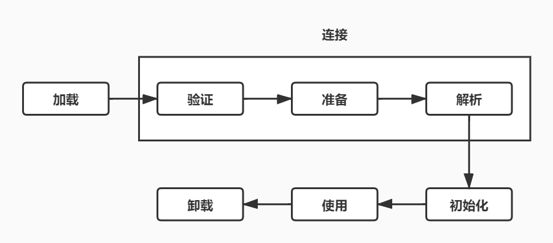
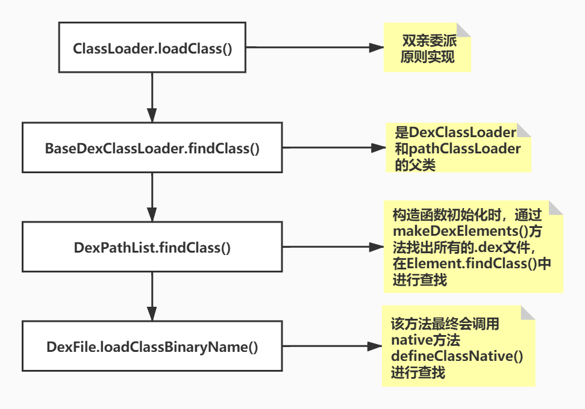
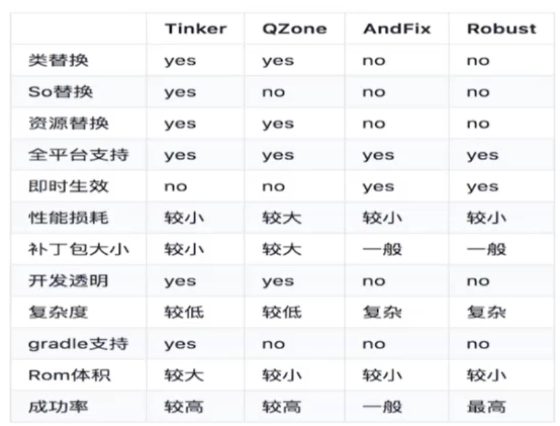

# 类加载机制

## 类加载流程：



## Android 中ClassLoader 的种类：

BootClassLoader：该ClassLoader 用于加载framework层的字节码文件

PathClassLoader：该ClassLoader 用于加载已经安装到系统中的APK中的字节码文件

DexClassLoader：该ClassLoader 用于加载指定目录中的字节码文件

BaseDexClassLoader：PathClassLoader 和DexClassLoader 都是该类的子类

一个APP的运行至少需要BootClassLoader 和PathClassLoader

## ClassLoader 源码

1. ClassLoader.java

      protected Class<?> loadClass(String name, boolean resolve)
           throws ClassNotFoundException
       {
               // First, check if the class has already been loaded
           	//先判断当前加载器是否已经加载这个类
           	//findLoadedClass()方法实际调用的是VMClassLoader 的一个native 方法
               Class<?> c = findLoadedClass(name);
          		if (c == null) {//未加载过
                   try {
                       if (parent != null) {//有父加载器
                           //父加载器进行查找加载
                           c = parent.loadClass(name, false);
                       } else {
                           //到达顶层
                           c = findBootstrapClassOrNull(name);
                       }
                   } catch (ClassNotFoundException e) {
                       // ClassNotFoundException thrown if class not found
                       // from the non-null parent class loader
                   }

                   if (c == null) {
                       // If still not found, then invoke findClass in order
                       // to find the class.
                       //再在该加载器加载范围中查找该类
                       c = findClass(name);
                   }
               }
               return c;
       }

2. DexClassLoader.java

   ```java
   /**
    * A class loader that loads classes from {@code .jar} and {@code .apk} files
    * containing a {@code classes.dex} entry. This can be used to execute code not
    * installed as part of an application.
    */
   //该类是动态加载的核心
   public class DexClassLoader extends BaseDexClassLoader {
       /**
        * Creates a {@code DexClassLoader} that finds interpreted and native
        * code.  Interpreted classes are found in a set of DEX files contained
        * in Jar or APK files.
        *
        * <p>The path lists are separated using the character specified by the
        * {@code path.separator} system property, which defaults to {@code :}.
        *
        * dexPath：要加载.dex文件的路径
        * optimizedDirectory：.dex文件要被copy到的路径，这个路径一般是一个应用程序路径
        * librarySearchPath：
        * parent：
        */
       public DexClassLoader(String dexPath, String optimizedDirectory,
               String librarySearchPath, ClassLoader parent) {
           super(dexPath, null, librarySearchPath, parent);
       }
   }
   ```

3. PathClassLoader.java

   ```java
   public class PathClassLoader extends BaseDexClassLoader {
       
       public PathClassLoader(String dexPath, ClassLoader parent) {
           super(dexPath, null, null, parent);
       }
   	
       //与DexClassLoader相比，少了一个要拷贝到的内部文件的路径，
       //PathClassLoader只能用于加载已经安装到系统中的APP中的.dex文件。
       public PathClassLoader(String dexPath, String librarySearchPath, ClassLoader parent) {
           super(dexPath, null, librarySearchPath, parent);
       }
   }
   ```

4. BaseDexClassLoader.java

   ```java
   public class BaseDexClassLoader extends ClassLoader {
       private final DexPathList pathList;
       
       //optimizedDirectory：该参数已弃用，没有任何效果
       public BaseDexClassLoader(String dexPath, File optimizedDirectory,
               String librarySearchPath, ClassLoader parent) {
           super(parent);
           this.pathList = new DexPathList(this, dexPath, librarySearchPath, null);
   
           if (reporter != null) {
               reportClassLoaderChain();
           }
       }
       
       @Override
       protected Class<?> findClass(String name) throws ClassNotFoundException {
           List<Throwable> suppressedExceptions = new ArrayList<Throwable>();
           
           //通过pathList传入要查找的类名来查找字节码文件
           Class c = pathList.findClass(name, suppressedExceptions);
           
           if (c == null) {
               ClassNotFoundException cnfe = new ClassNotFoundException(
                       "Didn't find class \"" + name + "\" on path: " + pathList);
               for (Throwable t : suppressedExceptions) {
                   cnfe.addSuppressed(t);
               }
               throw cnfe;
           }
           return c;
       }
   }
   ```

5. DexPathList.java

   ```java
   /*package*/ final class DexPathList {
       //要加载的文件都是.dex后缀
       private static final String DEX_SUFFIX = ".dex";
       private final ClassLoader definingContext;
       private Element[] dexElements;
       
       public DexPathList(ClassLoader definingContext, String dexPath,
               String librarySearchPath, File optimizedDirectory) {
   
           this.definingContext = definingContext;
   
           ArrayList<IOException> suppressedExceptions = new ArrayList<IOException>();
           // save dexPath for BaseDexClassLoader
           //主要方法，
           this.dexElements = makeDexElements(splitDexPath(dexPath), optimizedDirectory,
                                              suppressedExceptions, definingContext);
   
           // Native libraries may exist in both the system and
           // application library paths, and we use this search order:
           //
           //   1. This class loader's library path for application libraries (librarySearchPath):
           //   1.1. Native library directories
           //   1.2. Path to libraries in apk-files
           //   2. The VM's library path from the system property for system libraries
           //      also known as java.library.path
           //
           // This order was reversed prior to Gingerbread; see http://b/2933456.
           this.nativeLibraryDirectories = splitPaths(librarySearchPath, false);
           this.systemNativeLibraryDirectories =
                   splitPaths(System.getProperty("java.library.path"), true);
           List<File> allNativeLibraryDirectories = new ArrayList<>(nativeLibraryDirectories);
           allNativeLibraryDirectories.addAll(systemNativeLibraryDirectories);
   
           this.nativeLibraryPathElements = makePathElements(allNativeLibraryDirectories);
   
           if (suppressedExceptions.size() > 0) {
               this.dexElementsSuppressedExceptions =
                   suppressedExceptions.toArray(new IOException[suppressedExceptions.size()]);
           } else {
               dexElementsSuppressedExceptions = null;
           }
       }
       
       //下面该方法主要是通过遍历所有文件，将所有的.dex文件都找出来
       private static Element[] makeDexElements(List<File> files, File optimizedDirectory,
               List<IOException> suppressedExceptions, ClassLoader loader) {
         Element[] elements = new Element[files.size()];
         int elementsPos = 0;
         /*
          * Open all files and load the (direct or contained) dex files up front.
          */
         for (File file : files) {
             if (file.isDirectory()) {
                 // We support directories for looking up resources. Looking up resources in
                 // directories is useful for running libcore tests.
                 elements[elementsPos++] = new Element(file);
             } else if (file.isFile()) {
                 String name = file.getName();
   
                 if (name.endsWith(DEX_SUFFIX)) {
                     // Raw dex file (not inside a zip/jar).
                     try {
                         DexFile dex = loadDexFile(file, optimizedDirectory, loader, elements);
                         if (dex != null) {
                             elements[elementsPos++] = new Element(dex, null);
                         }
                     } catch (IOException suppressed) {
                         System.logE("Unable to load dex file: " + file, suppressed);
                         suppressedExceptions.add(suppressed);
                     }
                 } else {
                     DexFile dex = null;
                     try {
                         dex = loadDexFile(file, optimizedDirectory, loader, elements);
                     } catch (IOException suppressed) {
                         /*
                          * IOException might get thrown "legitimately" by the DexFile constructor if
                          * the zip file turns out to be resource-only (that is, no classes.dex file
                          * in it).
                          * Let dex == null and hang on to the exception to add to the tea-leaves for
                          * when findClass returns null.
                          */
                         suppressedExceptions.add(suppressed);
                     }
   
                     if (dex == null) {
                         elements[elementsPos++] = new Element(file);
                     } else {
                         elements[elementsPos++] = new Element(dex, file);
                     }
                 }
             } else {
                 System.logW("ClassLoader referenced unknown path: " + file);
             }
         }
         if (elementsPos != elements.length) {
             elements = Arrays.copyOf(elements, elementsPos);
         }
         return elements;
       }
       
       private static DexFile loadDexFile(File file, File optimizedDirectory, ClassLoader loader,Element[] elements)
               throws IOException {
           if (optimizedDirectory == null) {
               return new DexFile(file, loader, elements);
           } else {
               String optimizedPath = optimizedPathFor(file, optimizedDirectory);
               return DexFile.loadDex(file.getPath(), optimizedPath, 0, loader, elements);
           }
       }
       
       public Class<?> findClass(String name, List<Throwable> suppressed) {
           for (Element element : dexElements) {
               Class<?> clazz = element.findClass(name, definingContext, suppressed);
               if (clazz != null) {
                   return clazz;
               }
           }
           if (dexElementsSuppressedExceptions != null) {
               suppressed.addAll(Arrays.asList(dexElementsSuppressedExceptions));
           }
           return null;
       }
   
       /*package*/ static class Element {
           //.dex文件在Android中的具体实现
           private final DexFile dexFile;
       }
       
   }
   ```

6. DexFile.java

   ```java
   public final class DexFile {
       public Class loadClassBinaryName(String name, ClassLoader loader, List<Throwable> suppressed) {
           return defineClass(name, loader, mCookie, this, suppressed);
       }
       
       private static Class defineClass(String name, ClassLoader loader, Object cookie,
                                        DexFile dexFile, List<Throwable> suppressed) {
           Class result = null;
           try {
               result = defineClassNative(name, loader, cookie, dexFile);
           } catch (NoClassDefFoundError e) {
               if (suppressed != null) {
                   suppressed.add(e);
               }
           } catch (ClassNotFoundException e) {
               if (suppressed != null) {
                   suppressed.add(e);
               }
           }
           return result;
       }
       private static native Class defineClassNative(String name, ClassLoader loader, Object cookie,DexFile dexFile)
               throws ClassNotFoundException, NoClassDefFoundError;
   }
   ```

   

## Android 中动态加载的难点 

- 有许多组件类需要注册才能使用：
- 资源的动态加载比较复杂：
- Android 各个版本对于类的加载会有不同，适配上有一定的复杂性。

Android在运行时需要一个上下文环境。

什么是热修复？动态修复或更新APP的行为。

热修复的好处？在用户几乎没有感知的情况下对一些bug进行修复或者对一些小功能进行更新。

热修复的常见框架：

1. QQ空间的超级补丁方案
2. 微信的Tinker
3. 阿里的AndFix，dexposed
4. 美团的Robust，ele的migo，百度的hotfix

## 热修复技术对比：

